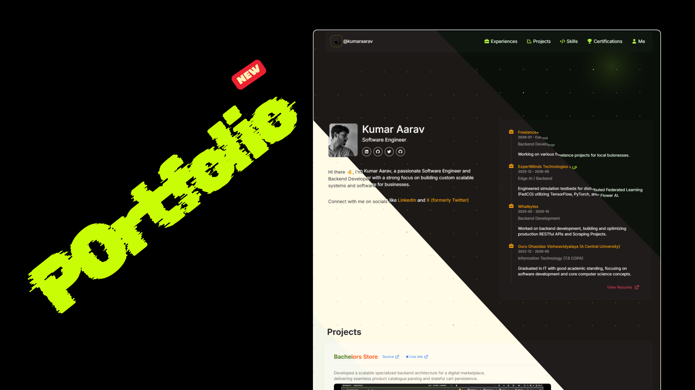

# Kumar Aarav — Portfolio

<p align="center">
  <a href="https://portfolio-five-gray-76.vercel.app/">
    
  </a>
</p>

<p align="center">
  <a href="https://portfolio-five-gray-76.vercel.app/">View the live portfolio</a>
  ·
  <a href="https://github.com/git-kumaraarav/portfoliov2">View the source</a>
  ·
  <a href="./portfolio-trailer.mp4">Watch the portfolio trailer</a>
</p>

Personal portfolio website for **Kumar Aarav**, a software engineer and backend
developer. The site presents professional experience, projects, skills,
certifications, and contact links in a responsive, interactive interface.

## Portfolio preview

Click the thumbnail below to watch the portfolio trailer:

[](./portfolio-trailer.mp4)

The trailer is also available directly as [`portfolio-trailer.mp4`](./portfolio-trailer.mp4).

## Built with

- [Next.js](https://nextjs.org/) 16
- [React](https://react.dev/) 19
- [TypeScript](https://www.typescriptlang.org/)
- [Tailwind CSS](https://tailwindcss.com/)
- [Motion](https://motion.dev/)
- [Vercel](https://vercel.com/) for deployment

## Features

- Responsive portfolio layout with animated sections
- About, experience, skills, certifications, projects, and contact sections
- Project cards with live demos, source repositories, and video previews
- Social profile links and downloadable résumé
- Custom visual effects, tooltips, and interactive components

## Getting started

### Prerequisites

- Node.js 20 or newer
- npm

### Installation

```bash
git clone https://github.com/git-kumaraarav/portfoliov2.git
cd portfoliov2
npm install
```

### Development

```bash
npm run dev
```

Open [http://localhost:3000](http://localhost:3000) in your browser.

### Production build

```bash
npm run build
npm start
```

## Project structure

```text
app/
├── components/       # Shared UI components
├── sections/         # Portfolio sections and profile data
├── globals.css       # Global styles
├── layout.tsx        # Root layout and metadata
└── page.tsx          # Portfolio page
public/               # Images, certificates, and static assets
portfolio-thumbnail.png
portfolio-trailer.mp4
```

Most portfolio content is maintained in
[`app/sections/Info.json`](./app/sections/Info.json).

## Contact

- [LinkedIn](https://www.linkedin.com/in/kumaraarav/)
- [GitHub](https://github.com/git-kumaraarav)
- [X / Twitter](https://twitter.com/kumaraaravX)
- [Instagram](https://www.instagram.com/ig.kumar.aarav/)
- [Email](mailto:work.kumaraarav@gmail.com)
